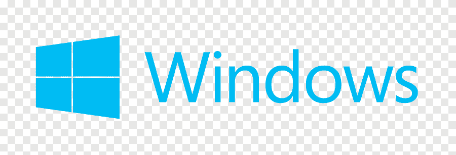

<p align="center"></p>
<h1 align="center"> Windows Tools </h1> 
<h4 align="right">Sep 24</h4>


<br>


# General

<p>Press <kbd>Win</kbd> + <kbd>Z</kbd> → split screen</p>

<p>Press <kbd>Win</kbd> + <kbd>Alt</kbd> + <kbd>R</kbd> → screen REC-SHOP / all screens / rectangule </p>

<p>Press <kbd>Win</kbd> + <kbd>shift</kbd> + <kbd>s</kbd>  → Captura pantalla</p>

<p>Press <kbd>Win</kbd> + <kbd>G</kbd> → xbox tools</p>

<p>Press <kbd>Win</kbd> + <kbd>S</kbd> →  Visor de Portapapeles, Menu con emoticones, symbols especiales</p>

<p>Press <kbd>Win</kbd> + <kbd>D</kbd> → Oculta todas las pantallas</p>

<p>Press <kbd>Win</kbd> + <kbd>H</kbd> → Rec voice</p>

<p>Press <kbd>Win</kbd> + <kbd>K</kbd> → Para conectar al televisor inalámbricamente</p>

<p>Press <kbd>Win</kbd> + <kbd>L</kbd> → bloquear pantalla computador</p>

<p>Press <kbd>Win</kbd> + <kbd>.</kbd> → agregar símbolos o emojis a lo que estas escribiendo  </p>

<p>Press <kbd>Ctrl</kbd> + <kbd>shift</kbd> + <kbd>Win</kbd> + <kbd>Alt</kbd>  → Run Office 360 On line</p>

<p>Press <kbd>Ctrl</kbd> + <kbd>shift</kbd> + <kbd>T</kbd>  → En el Browser restaura las ventanas cerradas</p>

<br>

# Maintenance

<p>Press <kbd>Win</kbd> + <kbd>R</kbd> write <kbd>mrt</kbd>  →  Malicious Software Removal Tool </p>

<p>Press <kbd>Win</kbd> + <kbd>R</kbd> write <kbd>%temp%</kbd> Delete file temp </p>

<p>Press <kbd>Ctrl</kbd> + <kbd>Shitf</kbd> + <kbd>Esc</kbd> choose Startup App  → Enable/Disable app startup </p>

```cmd (run administrator)``` 
```sfc / scannow``` => scan and fix disk
```chkdsk /r/f unidad``` => Busca errores en el disco
```arp -a``` =>  para ver todas las ip en la red 

<p>Press <kbd>Win</kbd> + <kbd>R</kbd> write <kbd>eventvwr</kbd> abre el "Visor de eventos" <br>
Registros de Windows/Aplicación/ Botón derecho en el nombre "vaciar registro" y Borrar<br>
Registros de Windows/Seguridad/ Botón derecho en el nombre "vaciar registro" y Borrar<br>
Registros de Windows/Instalación/ Botón derecho en el nombre "vaciar registro" y Borrar<br>
Registros de Windows/Sistema/ Botón derecho en el nombre "vaciar registro" y Borrar<br>
Registros de Windows/Eventos reenviar/ Botón derecho en el nombre "vaciar registro" y Borrar</p> 
> :bulb: **Tip:**  tarda un poco en mostrar los registros que se quieres eliminar

### Liberar espacio del disco
En el explorador de windows buscamos el disco principal <br>
**Propiedades/General/ Liberar espacio/** limpiar archivos de sistema <br>
**Propiedades/General/ Liberar espacio/** seleccionar archivos y aceptar <br>

> :warning: **Warning:** Tener cuidado de selecvcionar la carpeta de Descarga de windows, podrias borrar archivos de interes.

<br>

# Mejorar Rendimiento de Windows 10 (difiere un poco en windows 11)
Botón derecho en el icono de inicio / configuración 


```Configuraciones/Sistema/```<br>
**Notificaciones y Acciones/** deshabilitar todas las notificaciones <br>
**Ahorro de energía/** quitar la suspension e hibernación cuando no se usa <br>
**Experiencias compartidas/** deshabilitamos todo <br>
Bajar la calidad Visual de windows: <br>
**Acerca de/ configuración avanzada del sistema/Opciones Avanzadas/Rendimiento/configuración/Efectos Visuales/** Elegir según sea conveniente... <br>
**Acerca de/ configuración avanzada del sistema/Opciones Avanzadas/Rendimiento/configuración/Opciones avanzadas/** Ajustar para mejorar el rendimiento de: "Programas". Aceptar <br>

```Configuraciones/ Personalización/```<br>
**Colores/** desactivamos transparencia<br>
**Inicio /** desactivamos todos menos "mostrar lista de aplicaciones" / activarlo o desactivarlo<br>
**Barra de tarea/Area de notificación/** botón "Seleccionar iconos que aparecen en la barra de tarea". Esto te muestra lo que esta corriendo en segundo, para usuarios con experiencia.<br>
**Barra de tarea/Area de notificación/** botón "activar y desactivar iconos del sistema"/desactivar todos menos reloj/volumen/red<br>
**Barra de tarea/Noticias e interés/** desactivar todo<br>
**Pantalla de bloqueo/fondo/** poner imagen fija y desactivar la casilla de mostrar datos curiosos <br>
**Pantalla de bloqueo/fondo/** quitar las aplicaciones que mostrar en pantalla de bloqueo / poner ninguna <br>

```Configuraciones/ en el buscador ponemos "Aplicaciones en segundo plano"``` <br>
Desactivar todo. Elimina programas que corren en segundo plano siempre que arranca la PC


```Configuraciones/ Aplicaciones/```<br>
**inicio /** desactivar todas <br>

```Configuraciones/Juegos/```<br>
**Game Bar/** desactivar la Game Bar
**Modo de Juego/** desactivar modo de juego

```Configuraciones/Actualizaciones y seguridad/```<br>
**Windows Update/** actualizar y dejar en automático las actualizaciones...<br>
**Optimización de distribución/** desactivar la opción "Permitir descargas de otros equipos" <br>
**Optimización de distribución/** Opciones avanzadas/Configuración de descarga/activamos "Porcentaje de ancho de banda medido" y lo ponemos las opciones al 5% para descargar. Con esto bajamos el ancho de banda para que las actualizaciones no bajen el rendimiento de internet de otras aplicaciones <br>
**Optimización de distribución/Opciones avanzadas/configuración de carga/** activamos las casillas y dejamos todo al mínimo porcentaje (5%). Evitamos que si se activa la casilla de usar la PC para las actualizaciones de otros <br>

# Mas Acciones
En el buscador del botón inicio ```msconfig``` (configuración del sistema) <br>
**General / Selección de inicio/ inicio selectivo/** habilitamos "carga de servicios del sistema" y "Carga elementos de inicio" <br>
**Arranque/Opciones Avanzadas/** habilitamos "Números de procesadores" y seleccionamos el numero máximo en el menu desplegable, aceptar y reiniciar. Hara que windows aproveche al máximo el CPU al iniciar

<br>

# Activar Office 2024, 2021, 2019, 2016, 2013 y Microsoft 365
1. Cerrar Office
2. Abrir Power Shell como administrador (No funciona desde una ventana CMD)
3. Correr comando shell:
```shell
irm https://get.activated.win | iex
```
4. Press 2 (Ohook Office Permanent)
5. Press 1 (install Ohook Office Activation)
    - cuando diga: "Office is permanently actived" pulsar cualquier tecla
6. Press 0 (exit)

<br>

# Instalar Office LTSC 2021 
YouTube: https://www.youtube.com/watch?v=cW6RqGhBTEQ&ab_channel=AbrahamFranciscoBaez <br>
Office Oficial page: https://learn.microsoft.com/es-es/office/ltsc/2021/deploy

### Install
1. Descargar el ZIP Microsoft-Office-LTSC-2021 y descomprimir 
   - https://www.mediafire.com/file/j9v534odbj27a2v/Microsoft-Office-LTSC-2021.rar/file
2. Abrir terminal CMD como administrador (no sirve Power Shell)
3. llegar a la carpeta de office desde el terminal. (copiar la ruta desde el explorador de windows sample: cd ruta-Microsoft-Office-LTSC-2021)
4. Correr comando:
```shell
setup /configure carjavi-configuration.xml
```
5. Finish

<br>

# Google Tips 

> [!TIP]
>  Es posible extender una busqueda de información en ```Google``` agregando ```site: drive.google.com``` al final de la busqueda. 

Google browser sample:
```
modelo de negocio site:drive.google.com
```
> :warning: **Warning:** Algunos drives serán inasequibles por sus opciones de seguridad, pero otros estarán de fácil acceso.

<br>

> [!TIP]
> Search and read the full text of patents from around the world with Google Patents:  https://patents.google.com/

<br>

> [!TIP]
> google académico: https://scholar.google.es/

<br>

---
Copyright &copy; 2022 [carjavi](https://github.com/carjavi). <br>
```www.instintodigital.net``` <br>
carjavi@hotmail.com <br>
<p align="center">
    <a href="https://instintodigital.net/" target="_blank"></a>
</p>


