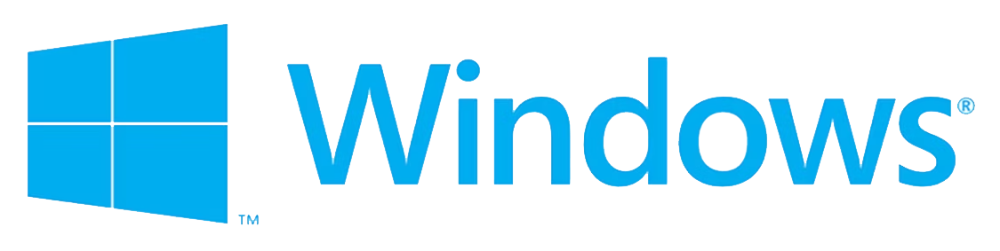

<p align="center"></p>
<h1 align="center"> Windows Tools </h1> 
<h4 align="right">Sep 24</h4>


<br>

# Maintenance

<p>Press <kbd>Win</kbd> + <kbd>R</kbd> write <kbd>mrt</kbd>   →  Malicious Software Removal Tool </p>

<p>Press <kbd>Win</kbd> + <kbd>R</kbd> write <kbd>%temp%</kbd> Delete file temp </p>

<p>Press <kbd>Ctrl</kbd> + <kbd>Shitf</kbd> + <kbd>Esc</kbd> choose Startup App  → Enable/Disable app startup </p>

```cmd (run administrator)```  sfc / scannow => scan and fix disk

<br>

# General

<p>Press <kbd>Win</kbd> + <kbd>Z</kbd> → split screen</p>

<p>Press <kbd>Win</kbd> + <kbd>Alt</kbd> + <kbd>R</kbd> → screen REC-SHOP / all screens / rectangule </p>

<p>Press <kbd>Win</kbd> + <kbd>G</kbd> → xbox tools</p>

<p>Press <kbd>Win</kbd> + <kbd>H</kbd> → Rec voice</p>

<p>Press <kbd>Win</kbd> + <kbd>K</kbd> → Para conectar al televisor inalámbricamente</p>

<p>Press <kbd>Win</kbd> + <kbd>L</kbd> → bloquear pantalla computador</p>

<p>Press <kbd>Win</kbd> + <kbd>.</kbd> → agregar símbolos o emojis a lo que estas escribiendo  </p>

<br>

> > [!NOTE]
>  Es posible extender una busqueda de información en ```Google``` agragando a la busqueda ```site: drive.google.com```. sasmple:

Google browser 
```
modelo de negocio site:drive.google.com
```
> :warning: **Warning:** Algunos drives serán inasequibles por sus opciones de seguridad, pero otros estarán de fácil acceso.

<br>

---
Copyright &copy; 2022 [carjavi](https://github.com/carjavi). <br>
```www.instintodigital.net``` <br>
carjavi@hotmail.com <br>
<p align="center">
    <a href="https://instintodigital.net/" target="_blank"></a>
</p>


